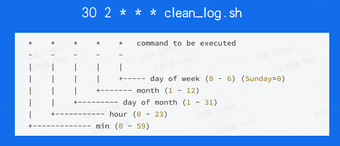
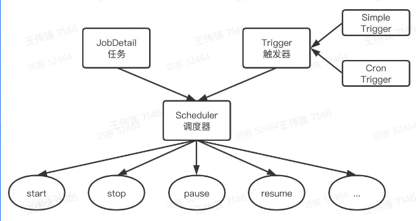

学习内容：「分布式定时任务」
- 前言
- 发展历程
- 实现原理
- 业务应用

收益：
- 知识面扩充
    - 对分布式定时任务建立起宏观的认知，并深入了解其实现原理
    - 了解关联的单机定时任务、大数据处理引擎，通过了解不同实现方案的优劣来拓展知识面
- 项目实践能力加强
    - 了解在哪些实际业务场景中使用分布式定时任务
    - 对于实际业务场景的中间件选型、技术方案设计做到成竹在胸

[手册-5](https://juejin.cn/post/7196322025114779703)

[toc]

# 前言

春节集卡瓜分20亿
- 抽卡
- 集齐
- 抽奖


分布式定时任务
- 自动化
- 定时执行
- 海量数据
- 高效稳定

# 发展历程

**Windows 批处理**

Case 1: 10分钟后Windows电脑自动关机
- Step1: 桌面空白处右键单击-新建-文本文档
- Step2:更改文件名和后缀为“自动关机.
- batStep3:修改文件内容为“shutdown -s -t 600”代表10分钟后关机
- Step4: 双击运行该批处理文件，电脑将会在10分钟之后自动关机

**Windows任务计划程序**

Case 2: 每天 12:00 自动疫情打卡


**Linux 命令-CronJob**

Case 3: 每天 02:30 定时清理机器日志


- Linux系统命令，使用简单，稳定可靠
- 只能控制单台机器，且无法适用于其他操作系统

**单机定时任务-Timer、Ticker**
Case 4: 每隔5分钟定时刷新本地缓存数据

- Java
```java
public static void main(String[] args) throws ParseException {
    Timer timer = new Timer();
    timer.schedule(new TimerTask() {
        @Override
        public void run() {
            SyncLocalCache();
        }
    }，5000，5 * 60 * 1000);
}
```
- go
```go
func main() {
    ticker := time.NewTicker(5 * time.Minute)
    for {
        select {
        case <-ticker.C:
            SyncLocalCache()
        }
    }
}
```
- 跨平台
- 仅单机可用

**单机定时任务-ScheduledExecutorService**

Case 5: 每隔5分钟定时执行多个任务
```java
private static ScheduledExecutorService scheduler;
    public static void main(String[] args) throws Exception {
        scheduler = Executors.newScheduledThreadPool(5);
        scheduler.scheduleAtFixedRate(((
                new Runnable() {
                    @Override
                    public void run() {
                        DoSomething();
                    }
                })),
        0，300,
        TimeUnit.SECONDS);
    }
```
- 拥有线程池功能
- 仅单机可用

**任务调度- Quartz**


- 单任务极致控制
- 没有负载均衡机制

## 分布式定时任务


- 平台化管理
- 分布式部署
- 支持海量数据

**什么是分布式定时任务**
- 定时任务是指系统为了自动完成特定任务，实时、延时、周期性完成任务调度的过程
- 分布式定时任务是把分散的、可靠性差的定时任务纳入统一的平台，并实现集群管理调度和分布式部署的一种定时任务的管理方式

按触发时机分类:
- 定时任务: 特定时间触发，比如今天15:06执行
- 延时任务:延时触发，比如10s后执行
- 周期任务: 固定周期时间，或固定频率周期调度触发，比如每隔5s或者每天12点执行

**特点**
- 自动化:全自动完成定时任务的调度和执行
- 平台化: 基于平台化的思维管控一系列的分布式定时任务
- 分布式:在分布式系统环境下运行任务调度，突破单机定时任务的性能瓶颈
- 伸缩性:采用集群方式部署，可以随时按需扩缩容
- 高可用: 单点故障不影响最终任务结果，可以做到故障转移

**执行方式**
- 单机任务: 随机触发一台机器执行任务，适用于计算量小、并发度低的任务
- 广播任务: 广播到所有机器上执行同一个任务，比如所有机器一起清理日志
- Map任务:一个任务可以分出多个子任务，每个子任务负责一部分的计算。适用于计算量大，单机无法满足要求的任务
- MapReduce任务:在Map任务的基础上，还可以对所有子任务的结果做汇总计算，适用于计算量大，并且需要对子任务结果做汇总的任务

## 业内定时任务框架


**Xxl-job**

- Xxl-job是大众点评员工许雪里于2015年发布的分布式任务调度平台是一个轻量级分布式任务调度框架，其核心设计目标是开发迅速、学习简单轻量级、易扩展。XXL-JOB 支持分片，简单支持任务依赖，支持子任务依赖不是跨平台的。
- Xxl-job很大一个优势在于开源且免费，并且轻量级，开箱即用，操作简易上手快，企业维护起来成本不高，因而在中小型公司使用非常广泛

**SchedulerX**
- 分布式任务调度 SchedulerX 2.0 是阿里巴巴基于 Akka 架构自研的新一代分布式任务调度平台，提供定时调度、调度任务编排和分布式批量处理等功能。
- SchedulerX 可在阿里云付费使用。它功能非常强大，在阿里巴巴内部广泛使用并久经考验

**TCT**
- 分布式任务调度服务 (Tencent Cloud Task) 是腾讯云自主研发的一款高性能、高可靠通用的分布式任务调度中间件，通过指定时间规则严格触发调度任务，保障调度任务的可靠有序执行。该服务支持国际通用的时间表达式、调度任务执行生命周期管理，解决传统定时调度任务单点及并发性能问题。 同时,支持任务分片、流程编排复杂调度任务处理能力，覆盖广泛的任务调度应用场
- TCT仅在腾讯内部使用，未开源，也未商用

## 拓展

分布式定时任务VS单机定时任务
- 关系
    - 都可以实现自动化的定时、延时、周期任务调度
- 差异
    - 分布式定时任务可支撑更大的业务体的
    - 分布式定时任务的性能、伸缩性、稳定性更高

分布式定时任务VS大数据处理引擎
- 关系:
    - 都可以对海量数据做处理
    - 性能、伸缩性、稳定性都很高
- 差异:
    - 定时并不是大数据处理引擎要解决的核心问题
    - 大数据处理引擎往往致力于将源数据处理成结果数据，分布式定时任务除了能做这个之外，还可以调用HTTP和RPC服务

# 实现原理

## 核心架构

分布式定时任务核心要解决触发、调度、执行三个关键问题
- 触发器: Trigger，解析任务，生成触发事件
- 调度器:Scheduler，分配任务，管理任务生命周期
- 执行器: Executor，获取执行任务单元，执行任务逻辑
- 除此之外，还需要提供一个控制台 (Admin) ，提供任务管理和干预的功能


**数据流**


**功能架构**


## 控制台

**基本概念**


- 任务: Job，任务元数据
- 任务实例: Joblnstance，周期任务会生成多个任务实例
- 任务结果: JobResult，任务实例运行的结果
- 任务历史: JobHistory.用户可以修改任务信息任务实例对应的任务元数据可以不同，因而使用任务历史存储

**任务元数据**
- 任务元数据 (Job) 是用户对任务属性定义，包括任务类型调度时机、执行行为等


**任务实例**


任务实例 (JobInstance) 是一个确定的 Job 的一次运行实例
- Job_id
- 触发时间
- 状态&结果
- 过程信息

## 触发器

核心职责
- 给定一系列任务，解析它们的触发规则，在规定的时间点触发任务的调度

设计约束
- 需支持大量任务
- 需支持秒级的调度
- 周期任务需要多次执行
- 需保证秒级扫描的高性能，并避免资源浪费

### 方案一：定期扫描+延时消息**
- (腾讯、字节方案)


### 方案二：实践轮


时间轮 ( Quartz 所用方案)
- 时间轮是一种高效利用线程资源进行批量化调度的一种调度模型。时间轮是一个存储环形队列，底层采用数组实现，数组中的每个元素可以存放一个定时任务列表

目标: 遍历任务列表，从中找出当前时间点需触发的任务列表

1.使用链表存储任务，每个元素代表一个任务
- 查询复杂度O(n)，修改复杂度O(1)

2.使用最小堆存储任务，按执行时间排序，每个节点存储同执行时间任务列表

- 查询复杂度O(1)，修改复杂度O(logn)

3.使用时间轮存储任务，每个节点存储同执行时间任务列表


- 查询复杂度O(1)，修改复杂度O(1)

4.使用多级时间轮存储任务，上一级时间轮转过对应刻度后把任务塞入下级时间轮中


### 高可用

核心问题
- 不同业务之间，任务的调度相互影响怎么办?
- 负责扫描和触发的机器挂了怎么办?

解法思路
- 存储上，不同国别、业务做资源隔离
- 运行时，不同国别、业务分开执行
- 部署时，采用多机房集群化部署，避免单点故障，通过数据库锁或分布式锁保证任务只被触发一次

单Trigger模式
- 会有单点故障
- 机器故障时平台崩溃

Trigger集群模式：Trigger 1、Trigger 2、Trigger N
- 可避免单点故障
- 需要避免同一任务被多次触发，导致业务紊乱

**数据库行锁模式**


- 在触发调度之前，更新数据库中JobInstance的状态，成功抢锁的才会触发调度
- 多台机器频繁竞争数据库锁，节点越多性能越差

**分布式锁模式**


- 在触发调度之前，尝试抢占分布式锁，可使用Redis锁或Zookeeper锁
- 性能较高，多家公司使用此方案

## 调度器

- 资源来源
- 资源调度
- 任务执行

### 资源来源

业务系统提供机器资源
- 使用该方案的公司:
    - 阿里、美团、字节等
- 优点:
    - 任务执行逻辑与业务系统共用同一份资源利用率更高
- 缺点:
    - 更容易发生定时任务脚本影响在线服务的事故
    - 不能由定时任务平台控制扩缩容

定时任务平台提供机器资源
- 使用该方案的公司:
    - 字节等
- 优点:
    - 任务执行逻辑与业务系统提供的在线服务隔离，避免相互影响
    - 可以支持优雅地扩缩容
- 缺点:
    - 消耗更多机器资源
    - 需要额外为定时任务平台申请接口调用权限而不能直接继承业务系统的权限

### 资源调度

**节点选择**
- 随机节点执行:选择集群中一个可用的执行节点执行调度任务。适用场景:定时对账
- 广播执行:在集群中所有的执行节点分发调度任务并执行。适用场景:批量运维
- 分片执行: 按照用户自定义分片逻辑进行拆分，分发到集群中不同节点并行执行，提升资源利用效率。适用场景: 海量日志统计

**任务分片**


- 通过任务分片来提高任务执行的效率和资源的利用率
- N个执行器Executor，M个业务数据区段，最好M>=N，且M是N的整数倍

**任务编排**


- 使用有向无环图 DAG(Directed Acyclic Graph) 进行可视化任务编排

**故障转移**
- 故障转移:确保部分执行单元任务失败时，任务最终成功


- 分片任务基于一致性hash策略分发任务，当某Executor异常时，调度器会将任务分发到其他Executor

**高可用**


- 调度器可以集群部署做到完全的无状态，靠消息队列的重试机制保障任务一定会被调度

## 执行器


- 基于注册中心，可以做到执行器的弹性扩缩容

## 小结

- 核心架构
    - 控制台Admin、触发器Trigger、调度器Scheduler、执行器Executor
- 业务模型
    - 任务元数据Job、任务实例JobInstance、任务结果JobResult、任务历史JobHistory
- 触发器
    - 定时扫描+延时消息
    - 时间轮
        - 链表、最小堆、时间轮、多级时间轮
- 调度器
    - 资源来源
    - 资源调度：节点选择、任务分片、任务编排、故障转移
- 执行器
    - 注册、调度、回调、心跳检测

# 业务应用

所有需要定时、延时、周期性执行任务的业务场景，都可以考虑使用分布式定时任务
- 电商
    - 订单30分钟未付款自动关闭订单
    - 定时给商家、达人发送消息，给用户发放优惠券等
- 互动
    - 支付宝集五福
    - 字节春节集卡瓜分红包
- 游戏
    - 活动结束后批量补发用户未领取的奖励
    - 定期更新游戏内榜单

**其他解决方案**

发货后超过10天未收货时系统自动确认收货
- 使用分布式定时任务的延时任务
- 使用消息队列的延时消息或者定时消息

春节集卡活动统计完成集卡的用户个数和总翻倍数
- 使用分布式定时任务的 MapReduce 任务
- 使用大数据离线处理引擎 Hive 离线做统计使用大数据实时处理引擎 Flink 实时做累计


**总结**


**思考**
- 分布式定时任务可以帮助我们处理哪些业务场景?
- 春节集卡瓜分20亿的玩法，发奖金额计算、实时开奖两个阶段分别用到分布式定时任务什么执行方式?
- 有了分布式定时任务，单机定时任务还有适用场景么?
- 时间轮这种数据结构，在定时/延时场景相比其他数据结构有哪些优势?
- 分布式定时任务的调度中心怎么判断一台执行器的机器处于可被调度状态?
- 你能想到哪些业务场景，实时计算引擎优于分布式定时任务?

