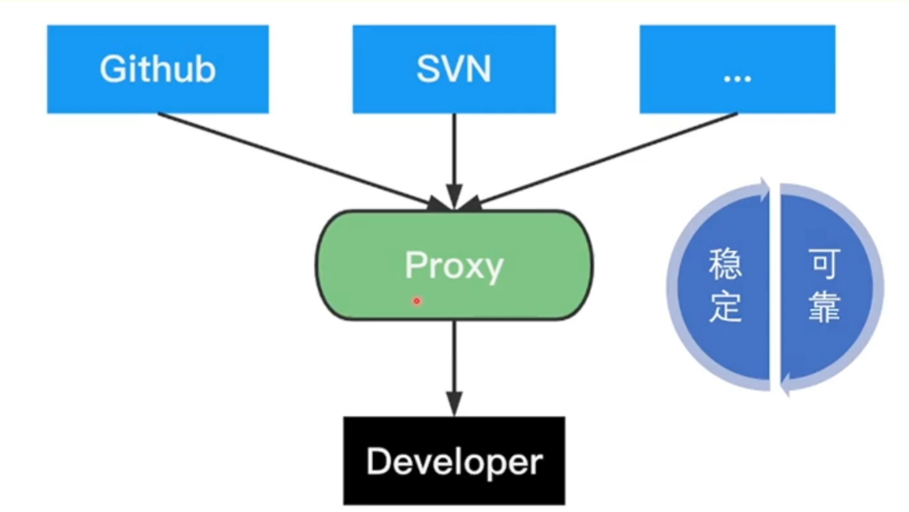
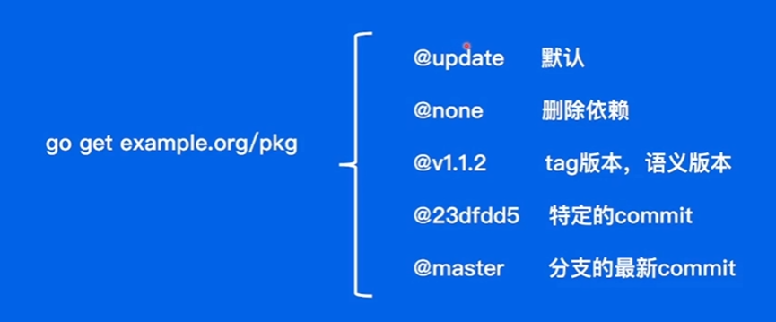
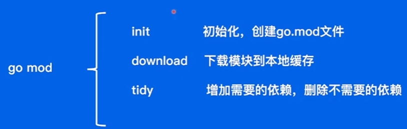

学习内容：「Go 语言进阶 - 工程进阶」
- 语言进阶
- 依赖管理
- 测试
- 项目实战

[toc]

# 1 语言进阶

从并发编程的视角了解 Go 高性能的本质

## 1.1 Goroutine

**并发vs并行**


- 并行：多线程程序在一个核的CPU 上运行
- 并发：多线程程序在多个核的CPU 上运行
- 并行是并发的一个手段

**协程（Goroutine）**

协程 vs 线程：
- 线程：内核态，线程跑多个协程，栈 MB 级别
- 协程，用户态，由 Go 语言本身完成，轻量级线程，栈 KB 级别

```go
//快速打印 hello goroutine：0~4
func hello(i int) {
    println("hello goroutine :" + fmt.Sprint(i))
}

func HelloGoRoutine() {
    for i:=0; i<5; i++ {
        go func(j int) {
            hetlo(j)
        }(i)
    }
    time.Sleep(time.Second) //保证子协程执行完成之前主协程不退出
}
```

## 1.2 CSP（Communicating Sequential Processes）


协程间的通信：
- 提倡通过通信共享内存

## 1.3 Channel

channel 实现通过通信共享内存

make(chan 元素类型，[缓冲大小])
- 无缓冲通道，make(chan int)，同步通道，会使接受和发送的协程同步化
- 有缓冲通道，make(chan int,2)，可以解决生产和消费执行效率不同的问题

```go
func CalSquare() {
	src := make(chan int)
	dest := make(chan int, 3)
	go func() {
		defer close(src) //资源关闭
		for i := 0; i < 10; i++ {
			src <- i
		}
	}()
	go func() {
		defer close(dest)
		for i := range src { //src 实现通信
			dest <- i * i
		}
	}()
	for i := range dest {
		//复杂操作
		fmt.Println(i)
	}
}
```

## 1.4 并发安全 Lock

实现通过共享内存实现通信
- 多个 Goroutine 同时操作一块资源内存
- 用 sync 包下的 Lock 实现并发安全地共享内存实现通信

```go
//对变量执行2000次+1操作，5个协程并发执行
var(
    x int64
    lock sync.Mutex
)

func addWithLock() { //加锁
    for i := 0; i<2000; i++ {
        lock.Lock()
        x += 1
        lock.Unlock()
    }
}
func addWithoutLock() { //不加锁
    for i := 0; i < 2000; i++ {
        x += 1
    }
}

func Add() { //测试
    x=0
    for i:= 0;i<5;i++ {
        go addWithoutLock()
    }
    time.Sleep(time.Second)
    printin( args...:"WithoutLock:"，x)
    x=0
    for i:= 0;i<5;i++ {
        go addWithLock()
    }
    time.Sleep(time.Second)
    println( args...:"WithLock:"，x)
}
```
执行结果：
- 不加锁错误输出
- 加锁正确输出 10000

## 1.5 WaitGroup

- 使用 `time.Sleep(time.Second)` 实现堵塞不够优雅，不知道子协程确切的执行时间，无法设置精确
- Go 中使用 WaitGroup 实现并发任务的同步，也在 sync 包中，3个方法：
    - 计数器：开始协程+1；执行结束-1；主协程堵塞直到计数器为0
    - Add(delta int)：计数器+delta
    - Done()：计数器-1
    - Wait()：堵塞直到计数器为0

```go
func ManyGoWait() {
    var wg sync.WaitGroup
    wg.Add( delta: 5) //初始计数器为5
    for i := 0; i<5;i++ {
        go func(j int) {
            defer wg.Done() //计数器-1
            hello(j)
        }(i)
    }
    wg.Wait() //直到计数器为0，即执行5次
}
```

# 2 依赖管理

了解 Go 语言依赖管理的演进路线

学会站在巨人的肩膀上
- 工程项目不可能基于标准库 0~1 编码搭建
- 依赖管理库

## 2.1 Go 语言依赖管理的演进路线


- 不同环境（项目）依赖的版本不同
- 控制依赖库的版本

**2.1.1 GOPATH**
- 环境变量 $GOPATH
    - /bin: 项目编译的二进制文件
    - /pkg：项目编译的中间产物，加速编译
    - /src：项目源码
- 项目代码直接依赖 src 下的代码
- go get 下载最新版本的包到 src 目录下
- 弊端：无法实现 package 的多版本控制

**2.1.2 Go Vendor**
- 项目目录下增加 vendor 文件，所有依赖包副本形式放在 $ProjectRoot/vendor
- 依赖寻址方法：vendor => GOPATH
- 通过每个项目引入一份依赖的副本，解决了多个项目需要同一个 package 依赖的冲突问题
- 问题：
    - 无法控制依赖的版本
    - 更新项目又可能出现依赖冲突，导致编译出错

**2.1.3 Go Module**
- 通过 `go.mod` 文件管理依赖包版本
- 通过 `go get/go mod` 指令工具管理依赖包
- 终极目标: 定义版本规则和管理项目依赖关系

## 2.2 依赖管理三要素

1. 配置文件，描述依赖 ——go.mod
2. 中心仓库管理依赖库 ——Proxy
3. 本地工具   ——go get/mod

**2.3.1 依赖配置 -go.mod**


**2.3.2 依赖配置 -version**
- 语义化版本
    - ${MAJOR}.${MINOR}.${PATCH}
    - 如：V1.3.0
- 基与 commit 伪版本
    - 语义化版本前缀+提交 commit 的时间戳+提交 commit 的哈希码前缀
    - 如：`vx.0.0-yyyymmddhhmmss-abcdefgh1234`

**2.3.3 依赖管理 -indirect**
- 对于没有直接导入的依赖模块（间接依赖）会标记为 indirect

**2.3.4 依赖配置- incompatible**
- 主版本2+模块会在模块路径增加/vN 后缀
- 对于没有 `go.mod` 文件并且主版本2+的依赖，会在版本号后面+ `incompatible`标识
- Go 会选择最低的**兼容**版本

**2.3.5 依赖分发**(Proxy)

使用第三方（Github等）代码托管平台下载依赖的问题
- 无法保证构建稳定性
    - 增加/修改/删除软件版本
- 无法保证依赖可用性
    - 删除软件
- 增加第三方压力
    - 代码托管平台负载问题

Proxy：


- 保证依赖稳定性

**2.3.6 依赖分发-变量 GOPROXY**
```
GOPROXY="https://proxy1.cn, https://proxy2.cn ,direct
```
- 服务站点URL列表，“direct”表示源站
- Proxy 1 -> Proxy 2 -> Direct

**2.3.7 工具**




# 3 测试

- 从单元测试实践出发，提升大家的质量意识
- 测试是避免事故的最后一道屏障
- 三种类型：
    - 回归测试：手动终端回归主流场景（如：刷抖音）
    - 集成测试：对系统功能维度测试验证（如：自动化回归测试）
    - 单元测试：面对测试开发阶段，决定代码质量
    - 从上到下，测试覆盖率变大，成本却降低

## 3.1 单元测试


**规则**
- 所有测试文件以 `_test.go` 结尾
- `func TestXxx(*testing.T)`
- 初始化逻辑放到 `TestMain` 中

**运行**
- `go test [flags] [packages]`

**assert**
- assert 包提供了 `assert.Equal(t, expectOutput, output)` 、Unequal 的方法

**覆盖率**
- 在 `go test` 最后加上 `--cover` 参数
- 可以测试出测试覆盖率
- tips:
    - 一般覆盖率 : 50%~60%，较高覆盖率80%+
    - 测试分支相互独立、全面覆盖
    - 测试单元粒度足够小，函数单一职责

**依赖**

单元测试的目标：
- 幂等：多次运行结果一样
- 稳定：单元测试是相互隔离的，可以任何时间任何函数独立运行

## Mock（打桩） 机制测试

常用mock 测试包：[monkey](https://github.com/bouk/monkey)
- 提供快速 Mock 函数，为一个函数或方法打桩
    - 用一个打桩函数替换原函数，运行时调用打桩函数
    - 两个方法：`Patch(target，replacement interface{})`、`Unpatch(target interface{})`,target:原函数，replacement：需要打桩的函数
- 实现稳定，不依赖本地测试文件

## 基准测试
- 优化代码，需要对当前代码分析
- 内置的测试框架提供了基准测试的能力
- 与单元测试规则一样，区别是以 `benchmark` 开头
- 通过 `-bench` 参数去运行

# 4 项目实战

通过项目需求、需求拆解、逻辑设计、代码实现带领大家感受真实的项目开发

## 需求设计

社区话题页面
- 展示话题 (标题，文字描述) 和回帖列表
- 暂不考虑前端页面实现，仅仅实现一个本地web服务
- 话题和回帖数据用文件存储

**需求用例：**
- Topic：话题，包括：id、title、content、create_time
- PostList：回帖，包括：id、topic_id、content、create_time
- Topic 和 PostList 的关系：一对多

**分层结构**


**组件工具**

- [Gin 高性能 go web 框架h](https://github.com/gin-gonic/gin#installation)
- Go Mod
    - `go mod init` + ProjectName
    - `go get gopkg.in/gin-gonic/gin.v1@v1.3.0`

## 代码开发

[项目源码](https://github.com/Moonlight-Zhao/go-project-example/tree/V0)
- [Repository](https://github.com/Moonlight-Zhao/go-project-example/tree/V0/repository)：
    - Topic、Post结构体及其基本方法：QueryTopicById（通过话题id查询话题）、QueryPostsByParentld（通过话题id查询话题的回帖）
    - index：用内存 Map 索引到数据行 `topicIndexMap map[int64]*Topic`、`postIndexMapmap[int64][]*Post`
- [Service](https://github.com/Moonlight-Zhao/go-project-example/tree/V0/service)
    - 参数校验 `checkParam()` -> 准备数据 `prepareInfo()` -> 组装实体 `PageInfo`
- [Contriller](https://github.com/Moonlight-Zhao/go-project-example/tree/V0/cotroller)
    - 构建View对象、业务错误码
- [Router](https://github.com/Moonlight-Zhao/go-project-example/blob/V0/server.go)
    - 初始化数据索引
    - 初始化引擎配置
    - 构建路由
    - 启动服务

## 测试运行

`go run sever.go`
