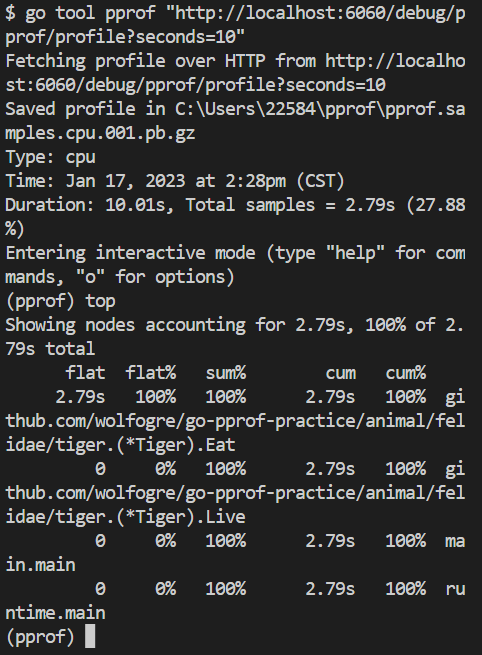
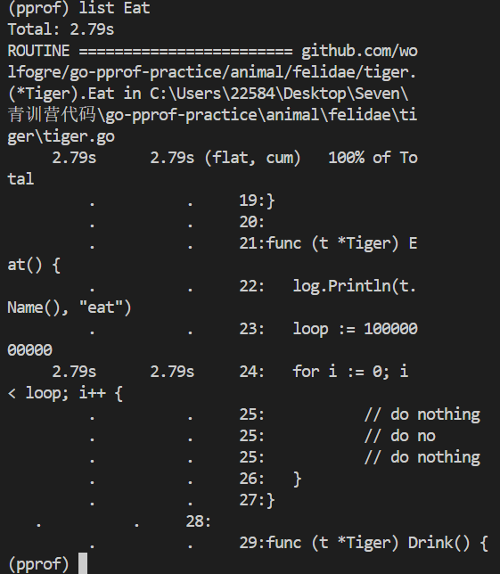

学习内容：「Go 高质量编程与性能调优」
- 如何编写更简洁清晰的代码
- 常用 Go 语言程序优化手段
- 熟悉 Go 程序性能分析工具
- 了解工程中性能优化的原则和流程

[toc]

# 1. 高质量编程

## 1.1 高质量编程简介

编写的代码能够达到正确可靠、简洁清晰的目标可称之为高质量代码
- 正确：各种边界条件是否考虑完备
- 可靠：异常情况处理，稳定性保证
- 简洁清晰：易读易维护

>实际应用场景千变万化，各种语言的特性和语法各不相同但是高质量编程遵循的原则是相通的

**编程原则：**
- 简单性
    - 消除“多余的复杂性”，以简单清晰的逻辑编写代码
    - 不理解的代码无法修复改进
- 可读性
    - 代码是写给人看的，而不是机器
    - 编写可维护代码的第一步是确保代码可读
- 生产力
    - 团队整体工作效率非常重要

## 1.2 编码规范

如何编写高质量的 Go 代码
- 代码格式
- 注释
- 命名规范
- 控制流程
- 错误和异常处理

### 1.2.1 代码格式

>推荐使用 gofmt 自动格式化代码

gofmt
- Go 语言官方提供的工具，能自动格式化 Go 语言代码为官方统一风格
- 常见IDE都支持方便的配置

goimports
- 也是 Go 语言官方提供的工具
- 实际等于 gofmt 加上依赖包管理
- 自动增删依赖的包引用、将依赖包按字母序排序并分类

### 1.2.2 注释

> 公共符号始终要注释

>Good code has lots of comments, bad code requires lots of comments
好的代码有很多注释，坏代码需要很多注释 
——Dave Thomas and Andrew Hunt

注释应该做的：
- 注释应该做的注释应该解释代码作用
- 注释应该解释代码如何做的
- 注释应该解释代码实现的原因
- 注释应该解释代码什么情况会出错

注释：
- 包中声明的每个公共的符号变量、常量、函数以及结构都需要添加注释
- 任何既不明显也不简短的公共功能必须予以注释
- 无论长度或复杂程度如何对库中的任何函数都必须进行注释

小结
- 代码是最好的注释
- 注释应该提供代码未表达出的上下文信息

### 1.2.3 编码规范-命名规范

>Good naming is like a good joke. If you have to explain it, it's not funny
好的命名就像一个好笑话。如果你必须解释它，那就不好笑了
——Dave Cheney

变量名
- 简洁胜于冗长
- 缩略词全大写，但当其位于变量开头且不需要导出时，使用全小写
    - 例如使用 ServeHTTP 而不是 ServeHttp
    - 使用 XMLHTTPRequest 或者 xmIHTTPRequest
- 变量距离其被使用的地方越远，则需要携带越多的上下文信息
    - 全局变量在其名字中需要更多的上下文信息，使得在不同地方可以轻易辨认出其含义

函数名
- 函数名不携带包名的上下文信息，因为包名和函数名总是成对出现的
- 函数名尽量简短
- 当名为 foo 的包某个函数返回类型 Foo 时，可以省略类型信息而不导致歧义
- 当名为 foo 的包某个函数返回类型 T 时(T 并不是 Foo) ，可以在函数名中加入类型信息

package 包的命名
- 只由小写字母组成。不包含大写字母和下划线等字符
- 简短并包含一定的上下文信息。例如 schema、task 等
- 不要与标准库同名。例如不要使用 sync 或者 strings
- 以下规则尽量满足，以标准库包名为例
    - 不使用常用变量名作为包名。例如使用 bufio 而不是 buf
    - 使用单数而不是复数。例如使用 encoding 而不是 encodings
    - 谨慎地使用缩写。例如使用 fmt 在不破坏上下文的情况下比 format 更加简短

小结
- 核心目标是降低阅读理解代码的成本
- 重点考虑上下文信息，设计简洁清晰的名称

### 1.2.4 控制流程

- 避免嵌套，保持正常流程清晰
    - 如果两个 if-else 分支中都包含 return 语句，则可以去除冗余的 else
- 尽量保持正常代码路径为最小缩进
    - 优先处理错误情况/特殊情况，尽早返回或继续循环来减少嵌套
```go
// Bad
func OneFunc( ) error {
    err := doSomething( )
    if err == nil {
        err := doAnotherThing( )
        if err == nil {
            return nil // normal case
        }
        return err
    }
    return err
}
```
- 最常见的正常流程的路径被嵌套在两个 if 条件内
- 成功的退出条件是 return nil，必须仔细匹配大括号来发现函数最后一行返回一个错误，需要追溯到匹配的左括号，才能了解何时会触发错误
- 如果后续正常流程需要增加一步操作，调用新的函数，则又会增加一层嵌套
```go
// Good
func OneFunc() error {
    if err := doSomething(); err != nil {
        return err
    }
    if err := doAnotherThing(); err != nil {
        return err
    }
    return nil // normal case
}
```
小结
- 线性原理，处理逻辑尽量走直线，避免复杂的嵌套分支
- 正常流程代码沿着屏幕向下移动
- 提升代码可维护性和可读性
- 故障问题大多出现在复杂的条件语句和循环语句中

### 1.2.5 错误和异常处理
简单错误
- 简单的错误指的是仅出现一次的错误，且在其他地方不需要捕获
- 该错误优先使用 `errors.New` 来创建匿名变量来直接表示简单错误
- 如果有格式化的需求，使用 fmt.Errorf

错误的 Wrap 和 Unwrap （包装和解包）
- 错误的 Wrap 实际上是提供了一个 error 嵌套另一个error 的能力，从而生成一个 error 的跟踪链
- 在 `fmt.Errorf` 中使用: `%w` 关键字来将一个错误关联至错误链中

错误判定
- 判定一个错误是否为特定错误，使用 `errors.ls`
- 不同于使用 ==，使用该方法可以判定错误链上的所有错误是否含有特定的错误
- 在错误链上获取特定种类的错误，使用 `errors.As`

panic
- 不建议在业务代码中使用 panic
- 调用函数不包含 recover 会造成程序崩溃
- 若问题可以被屏蔽或解决，建议使用 error 代替 panic
- 当程序启动阶段发生不可逆转的错误时，可以在 init 或 main 函数中使用 panic

recover
- recover 只能在被 defer 的函数中使用
- 嵌套无法生效
- 只在当前 goroutine 生效
- defer 的语句是后进先出
- 如果需要更多的上下文信息，可以 recover 后在 log 中记录当前的调用栈

小结
- error 尽可能提供简明的上下文信息链，方便定位问题
- panic 用于真正异常的情况
- recover 生效范围，在当前 goroutine 的被 defer 的函数中生效

## 1.3 性能优化建议

简介
- 性能优化的前提是满足正确可靠、简洁清晰等质量因素
- 性能优化是综合评估，有时候时间效率和空间效率可能对立
- 针对 Go 语言特性，介绍 Go 相关的性能优化建议

### 1.3.1 Benchmark
如何使用
- 性能表现需要实际数据衡量
- Go 语言提供了支持基准性能测试的 benchmark 工具
- `go test -bench=. -benchmem`


### 3.1.2 slice

slice 预分配内存：在尽可能的情况下，在使用 make() 初始化切片时提供容量信息，特别是在追加切片时
- [原理](https://ueokande.github.io/go-slice-tricks/)
- 切片本质是一个数组片段的描述
    - 包括了数组的指针
    - 片段的长度
    - 片段的容量(不改变内存分配情况下的最大长度)
- 切片操作并不复制切片指向的元素，创建一个新的切片会复用原来切片的底层数组，因此切片操作是非常高效的
- 切片有三个属性，指针(ptr)、长度(len) 和容量(cap)。append 时有两种场景：
    - 当 append 之后的长度小于等于 cap，将会直接利用原底层数组剩余的空间
    - 当 append 后的长度大于 cap 时，则会分配一块更大的区域来容纳新的底层数组
- 因此，为了避免内存发生拷贝，如果能够知道最终的切片的大小，预先设置 cap 的值能够获得最好的性能

另一个陷阱：大内存得不到释放
- 在已有切片的基础上进行切片，不会创建新的底层数组。因为原来的底层数组没有发生变化，内存会一直占用，直到没有变量引用该数组
- 场景
    - 原切片较大，代码在原切片基础上新建小切片
    -   原底层数组在内存中有引用，得不到释放
- 推荐的做法，使用 copy 替代 re-slice

### 3.1.3 Map

原理
- 不断向 map 中添加元素的操作会触发 map 的扩容
- 根据实际需求提前预估好需要的空间（与 slice 一样）
- 提前分配好空间可以减少内存拷贝和 Rehash 的消耗

### 1.3.4 字符串处理

常见的字符串拼接方式
- `+`
- `strings.Builder`
- `bytes.Buffer`
- `strings.Builder` 最快，`bytes.Buffer` 较快，`+` 最慢
- **使用 strings.Builder**

原理
- 字符串在 Go 语言中是不可变类型，占用内存大小是固定的，当使用 `+` 拼接 2 个字符串时，生成一个新的字符串，那么就需要开辟一段新的空间，新空间的大小是原来两个字符串的大小之和
- `strings.Builder`，`bytes.Buffer` 的内存是以倍数申请的
- `strings.Builder` 和 `bytes.Buffer` 底层都是 []byte 数组
- `bytes.Buffer` 转化为字符串时重新申请了一块空间，存放生成的字符串变量
- `strings.Builder` 直接将底层的 []byte 转换成了字符串类型返回

### 1.3.5 空结构体

使用空结构体节省内存
- 空结构体不占据内存空间，可作为占位符使用
- 可作为各种场景下的占位符使用节省资源
- 空结构体本身具备很强的语义，即这里不需要任何值，仅作为占位符
- 比如实现简单的 Set
    - Go 语言标准库没有提供 Set 的实现，通常使用 map 来代替
    - 对于集合场景，只需要用到 map 的键而不需要值
    - 即使是将 map 的值设置为 bool 类型，也会多占据 1 个字节空间

### 1.3.6 atomic 包


原理
- 锁的实现是通过操作系统来实现，属于系统调用，atomic 操作是通过硬件实现的，效率比锁高很多
- `sync.Mutex` 应该用来保护一段逻辑，不仅仅用于保护一个变量
- 对于非数值系列，可以使用 `atomic.Value`，`atomic.Value` 能承载一个 `interface{}`

总结
。避免常见的性能陷阱可以保证大部分程序的性能
针对普通应用代码，不要一味地追求程序的性能，应当在满足正确可靠、简洁清晰等质量要求的前提下提高程序性能

### 小结

- 避免常见的性能陷阱可以保证大部分程序的性能
- 普通应用代码，不要一味地追求程序的性能
- 越高级的性能优化手段越容易出现问题
- 在满足正确可靠、简洁清晰的质量要求的前提下提高程序性能

# 2. 性能调优实战

## 2.1 性能调优简介

性能调优原则
- 要依靠数据不是猜测
- 要定位最大瓶颈而不是细枝末节
- 不要过早优化
- 不要过度优化

## 2.2 性能分析工具

性能调优的核心是性能瓶颈的分析，对于 Go 应用程序，最方便的就是 pprof 工具

pprof 功能说明
- pprof 是用于可视化和分析性能分析数据的工具
- 可以知道应用在什么地方耗费了多少 CPU、memory 等运行指标


## 2.3 pprof 实践

[实践项目](https://github.com/wolfogre/go-pprof-practice)
- 前置准备，熟悉简单指标，能够编译运行 pprof 测试项目

实际分析排查过程
- 排查 CPU 问题
    - 命令行分析：`go tool pprof "http://localhost:6060/debug/pprof/profile?seconds=10"`
    - top 命令
    
        - flat：当前函数本身的执行耗时
        - flat%：flat 占 CPU 总时间的比例
        - sum%：上面每一行的 flat% 总和
        - cum：指当前函数本身加上其调用函数的总耗时
        - cum%：cum 占 CPU 总时间的比例
        - 函数中没有调用其他函数时，Flat == cum
        - 函数中只有其他函数的调用，Flat = 0
    - list 命令
    
    - 熟悉 web 页面分析(需要下载[graphviz](https://www.graphviz.org/download/))
    - 调用关系图，火焰图
    - `go tool pprof -http=:8080 "http://localhost:6060/debug/pprof/cpu"`
- 排查堆内存问题：`go tool pprof -http=:8080 "http://localhost:6060/debug/pprof/heap"`(需要下载[graphviz](https://www.graphviz.org/download/))
- 排查协程问题：`go tool pprof -http=:8080 "http://localhost:6060/debug/pprof/goroutine"`

- 排查锁问题：`go tool pprof -http=:8080 "http://localhost:6060/debug/pprof/mutex"`
- 排查阻塞问题：`go tool pprof -http=:8080 "http://localhost:6060/debug/pprof/block"`

pprof 的采样过程和原理
- CPU 采样
- 堆内存采样
- 协程和系统线程采样
- 阻塞操作和锁竞争采样

## 2.4 性能调优案例

**基本概念**
- 服务：能单独部署，承载一定功能的程序
- 依赖：Service A 的功能实现依赖 Service B 的响应结果，称为 Service A 依赖 Service B
- 调用链路：能支持一个接口请求的相关服务集合及其相互之间的依赖关系
- 基础库：公共的工具包、中间件

**业务优化**

流程
- 建立服务性能评估手段
- 分析性能数据，定位性能瓶颈
- 重点优化项改造
- 优化效果验证

建立压测评估链路
- 服务性能评估
- 构造请求流量
- 压测范围
- 性能数据采集

分析性能火焰图，定位性能瓶颈
- pprof 火焰图

重点优化项分析
- 规范组件库使用
- 高并发场景优化
- 增加代码检查规则避免增量劣化出现
- 优化正确性验证

上线验证评估
- 逐步放量，避免出现问题

进一步优化，服务整体链路分析
- 规范上游服务调用接口，明确场景需求
- 分析业务流程，通过业务流程优化提升服务性能

**基础库优化**
- 适应范围更广，覆盖更多服务

AB 实验 SDK 的优化
- 分析基础库核心逻辑和性能瓶颈
- 完善改造方案，按需获取，序列化协议优化
- 内部压测验证
- 推广业务服务落地验证

**Go 语言优化**
- 适应范围最广，Go 服务都有收益

优化方式
- 优化内存分配策略
- 优化代码编译流程，生成更高效的程序
- 内部压测验证
- 推广业务服务落地验证
