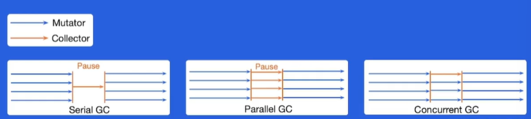

学习内容：「Go 语言内存管理详解」
- 性能优化的概念
- 自动内存管理
- Go 内存管理及优化
- 编译器和静态分析
- Go 编译器优化


课程: 高性能 Go 语言发行版优化与落地实践
- 优化
    - 内存管理优化
    - 编译器优化
- 背景
    - 自动内存管理和 Go 内存管理机制
    - 编译器优化的基本问题和思路
- 实践：字节跳动遇到的性能问题以及优化方案

[toc]

# 1. 性能优化的概念

## 1.1 性能优化的基本问题

性能优化是什么?
- 提升软件系统处理能力，减少不必要的消耗，充分发掘计算机算力

为什么要做性能优化?
- 用户体验: 带来用户体验的提升 - 让刷抖音更丝滑，让双十一购物不再卡顿
- 资源高效利用: 降低成本，提高效率 一 很小的优化乘以海量机器会是显著的性能提升和成本节约

## 1.2 性能优化的两个层面


## 1.3 性能优化的可维护性


# 2. 自动内存管理

## 2.1 概念
- 动态内存
    - 程序在运行时根据需求动态分配的内存: malloc()
- 自动内存管理 (垃圾回收) : 由程序语言的运行时系统管理动态内存
    - 避免手动内存管理，专注于实现业务逻辑
    - 保证内存使用的正确性和安全性；如：double-free problem：连续释放两块内存, use-after-free problem 内存释放后使用
- 三个任务
    - 为新对象分配空间
    - 找到存活对象
    - 回收死亡对象的内存空间

**相关概念**
- Auto memory management: 自动内存管理
- Grabage collction: 垃圾回收
- Mutator: 业务线程，分配新对象，修改对象指向关系
- Collector: GC 线程，找到存活对象，回收死亡对象的内存空间
- Serial GC：只有一个 collector
- Parallel GC: 并行 GC，支持多个 collectors 同时回收的 GC 算法
- Concurrent GC: 并发 GC，mutator(s) 和 collector(s) 可以同时执行
    - Collectors 必须感知对象指向关系的改变!



评价 GC 算法
- 安全性(Safety): 不能回收存活的对象——基本要求
- GC 时间吞吐率(Throughput): 1- GC 上的时间/程序执行总时间——花在 GC 上的时间
- 暂停时间 (Pause time): stop the world (STW) ——业务是否感知，越短越好
- 内存开销 (Space overhead)：GC 元数据开销

两种常见 GC 技术
- 追踪垃圾回收(Tracing garbage collection)
- 引用计数(Reference counting)

## 2.2 追踪垃圾回收

- 对象被回收的条件: 指针指向关系不可达的对务
- 标记根对象
    - 静态变量、全局变量、常量、线程栈等
- 标记: 找到可达对象
    - 求指针指向关系的传递闭包: 从根对象出发，找到所有可达对象
- 清理: 所有不可达对象
    - 将存活对象复制到另外的内存空间(Copying GC)：分配新空间
    - 将死亡对象的内存标记为"可分配”(Mark-sweep GC)
    - 移动并整理存活对象(Mark-compact GC)：原地整理对象
- 根据对象的生命周期，使用不同的标记和清理策略

## 2.3 分代 GC (Generational GC)

分代假说(Generational hypothesis): most objects die young
- Intuition（原因）: 很多对象在分配出来后很快就不再使用了
- 每个对象都有年龄: 经历过 GC 的次数
- 目的: 对年轻和老年的对象，制定不同的 GC 策略，降低整体内存管理的开销
- 不同年龄的对象处于 heap 的不同区域

年轻代(Young generation)
- 常规的对象分配
- 由于存活对象很少，可以采用 copying collection
- GC“吞吐率很高

老年代(Old generation)
- 对象趋向于一直活着，反复复制开销较大
- 可以采用 mark-sweep collection

## 2.4 引用计数

- 每个对象都有一个与之关联的引用数目
- 对象存活的条件: 当且仅当引用数大于 0

优点
- 内存管理的操作被平摊到程序执行过程中
- 内存管理不需要了解 runtime 的实现细节: C++ 智能指针 (smart pointer)

缺点
- 维护引用计数的开销较大: 通过原子操作保证对引用计数操作的原子性和可见性
- 无法回收环形数据结构 —— 解决方法：weak reference
- 内存开销: 每个对象都引入的额外内存空间存储引用数目
- 回收内存时依然可能引发暂停

## 2.5 总结
- 自动内存管理的背景和意义
- 概念和评价方法
- 追踪垃圾回收
- 引用计数
- 分代 GC
- 学术界和工业界在一直在致力于解决自动内存管理技术的不足之处
    - [PLDI'22 Low-Latency, High-Throughput Garbage Collection](https://users.cecs.anu.edu.au/~steveb/pubs/papers/lxr-pldi-2022.pdf)

# 3. Go 内存管理及优化

## 3.1 Go 内存分配

**分块**
- 目标：为对象在 heap 上分配内存
- 提前将内存分块
    - 调用系统调用 mmap() 向 OS 申请一大块内存，例如 4 MB
    - 先将内存划分成大块，例如 8 KB，称作 mspan
    - 再将大块继续划分成特定大小的小块，用于对象分配
    - noscan mspan: 分配不包含指针的对象 —— GC 不需要扫描
    - scan mspan: 分配包含指针的对象 —— GC 需要扫描
- 对象分配: 根据对象的大小，选择最合适的块返回

**缓存**

- TCMalloc: TC：thread caching（线程缓存）
- 每个 p 包含一个 mcache 用于快速分配，用于为绑定于 p 上的 g 分配对象
- mcache 管理一组 mspan
- 当 mcache 中的 mspan 分配完毕，向 mcentral 申请带有未分配块的 mspan
- 当 mspan 中没有分配的对象，mspan 会被缓存在
mcentral 中，而不是立刻释放并归还给 OS


## 3.2 Go 内存管理优化
- 对象分配是非常高频的操作: 每秒分配 GB 级别的内存
- 小对象占比较高
- Go 内存分配比较耗时
    - 分配路径长: g -> m -> p -> mcache -> mspan -> memory block -> return pointer
    - pprof: 对象分配的函数是最频繁调用的函数之一

## 3.3 Balanced GC
>字节的优化方案
- 每个 g 都绑定一大块内存 (1 KB) ，称作 goroutine allocation buffer (GAB)
- GAB 用于 noscan 类型的小对象分配: < 128 B
- 使用三个指针维护 GAB: base,end,top
- Bump pointer (指针碰撞) 风格对象分配
    - 无须和其他分配请求互斥
    - 分配动作简单高效

```go
//对象分配
if top + size <= end {
    addr := top
    top += size
    return addr
}
```

- GAB 对于 Go 内存管理来说是一个大对象
- 本质: 将多个小对象的分配合并成一次大对象的分配
- 问题: GAB 的对象分配方式会导致内存被延迟释放
- 方案:移动 GAB 中存活的对象
    - 当 GAB 总大小超过一定值时。将 GAB 中存活的对象复制到另外分配的 GAB 中
    - 原先的 GAB 可以释放，避免内存泄漏
    - 本质: 用 copying GC 的算法管理小对象

## 3.4 总结
- Go 内存管理 —— 分块
- Go 内存管理 —— 缓存
- Go 对象分配的性能问题
    - 分配路径过长
    - 小对象居多
- Balanced GC
    - 指针碰撞风格的对象分配
    - 实现了 copying GC
    - 性能收益

# 4. 编译器和静态分析

## 4.1 编译器的结构

- 重要的系统软件
    - 识别符合语法和非法的程序
    - 生成正确且高效的代码
- 分析部分 (前端 front end)
    - 词法分析，生成词素(lexeme)
    - 语法分析，生成语法树
    - 语义分析，收集类型信息，进行语义检查
    - 中间代码生成，生成 intermediate representation (IR
- 综合部分 (后端 back end)：方法是静态分析
    - 代码优化，机器无关优化，生成优化后的 IR
    - 代码生成，生成目标代码


## 4.2 静态分析

- 静态分析: 不执行程序代码，推导程序的行为分析程序的性质
- 控制流(Control flow): 程序执行的流程，转为控制流图（Control-flow graph）
- 数据流(Data flow): 数据在控制流上的传递
- 通过分析控制流和数据流，我们可以知道更多关于程序的性质 (properties)，根据这些性质优化代码

## 4.3 过程内分析和过程间分析
- 过程内分析(Intra-procedural analysis)：仅在函数内部进行分析
- 过程间分析(Inter-procedural analysis)：考虑函数调用时参数传递和返回值的数据流和控制流

```go
type I interface {
    foo()
}
type A struct{}
type B struct{}
func (a *A) foo() {
    ...
}
func (b *B) foo() {
    ...
}
func bar() {
    ...
    i. foo()
}
```


- 为什么过程间分析是个问题?
    - 需要通过数据流分析得知 i 的具体类型，才能知道 i.foo() 调用的是哪个 foo()
    - 根据 i 的具体类型，产生了新的控制流，i.foo()，分析继续
    - 过程间分析需要同时分析控制流和数据流 联合求解，比较复杂

## 4.3 总结
- 编译器的结构与编译的流程
- 编译器后端优化
- 静态分析（编译器后端优化的方法）
    - 数据流分析和控制流分析
    - 过程内分析和过程间分析

# 5. Go 编译器优化

- 为什么做编译器优化
    - 用户无感知，重新编译即可获得性能收益
    - 通用性优化
- 现状
    - 采用的优化少
    - 编译时间较短，没有进行较复杂的代码分析和优化
- 字节编译优化的思路
    - 场景: 面向后端长期执行任务
    - Tradeof: 用编译时间换取更高效的机器码
- Beast mode（字节的方式）
    - **函数内联**
    - **逃逸分析**
    - 默认栈大小调整
    - 边界检查消除
    - 循环展开
    - ...

## 5.1 函数内联（Inlining）
- 内联: 将被调用函数的函数体(callee) 的副本替换到调用位置(caller) 上，同时重写代码以反映参数的绑定
- 优点
    - 消除函数调用开销，例如传递参数、保存奇存器等
    - 将过程间分析转化为过程内分析，帮助其他优化，例如逃逸分析


- 缺点
    - 函数体变大，instruction cache (icache) 不友好
    - 编译生成的 Go 镜像变大
- 函数内联在大多数情况下是正向优化
- 内联策略：调用和被调函数的规模等

## 5.2 Beast Mode
- 函数内联受到的限制较多
    - 语言特性，例如 interface, defer 等，限制了函数内联 
    - 内联策略非常保守
- Beast mode: 调整函数内联的策略，使更多函数被内联
    - 降低函数调用的开销
    - 增加了其他优化的机会: **逃逸分析**
- 开销
    - Go 镜像增加 ~10%
    - 编译时间增加

## 5.3 逃逸分析

- 逃逸分析: 分析代码中指针的动态作用域: 指针在何处可以被访问

大致思路
- 从对象分配处出发，沿着控制流，观察对象的数据流
- 若发现指针 p 在当前作用域 s
    - 作为参数传递给其他函数
    - 传递给全局变量
    - 传递给其他的 goroutine
    - 传递给已逃逸的指针指向的对象
- 则指针 p 指向的对象逃逸出 s，反之则没有逃逸出 s

Beast mode：函数内联拓展了函数边界，更多对象不逃逸
- 优化: 未逃逸的对象可以在栈上分配
    - 对象在栈上分配和回收很快: 移动 sp
    - 减少在 heap 上的分配，降低 GC 负担


## 5.4 总结

- Go 编译器优化的问题
- Beast mode
- 函数内联
- 逃逸分析
- 通过 micro-benchmark 快速验证性能优化
- 性能收益


>课程总结：高性能 Go 语言发行版优化与落地实践
- 性能优化
    - 自动内存管理
    - Go 内存管理
    - 编译器与静态分析
    - 编译器优化
- 实践
    - Balanced GC 优化对象分配
    - Beast mode 提升代码性能
- 分析问题的方法与解决问题的思路，不仅适用于 Go 语言，其他语言的优化也同样适用

