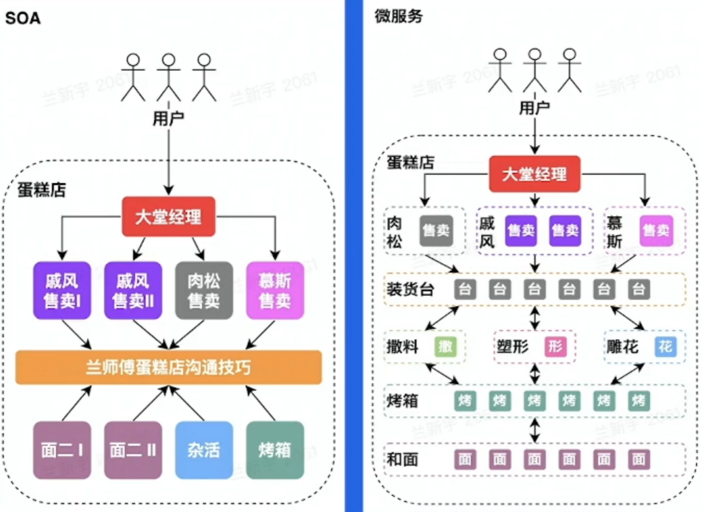

学习内容：「架构初探 - 谁动了我的蛋糕」
- 什么是架构
- 企业级后端架构剖析
- 企业级后端架构的挑战
- 后端架构实战

Q：
兰师傅蛋糕坊要开张了

# 什么是架构

**定义**：架构，又称软件架构
- 是有关软件整体结构与组件的抽象描述
- 用于指导软件系统各个方面的设计
- 实现一个软件有很多种方法，架构在方法选择上起着至关重要的指导作用
- 架构的重要性：
    - 地基没打好，大厦容易倒
    - 地基坚实了，大厦才能盖得高
    - 站在巨人肩膀上，才能看得远

须解决如下问题：
- 如何做蛋糕独家秘方：还是亲自做比较好
- 如何卖蛋糕：刚开始客流量应该不大，边做边卖

## 单机
- 软件系统需要具备对外提供服务，单机，就是把所有功能都实现在一个进程里，并部署在一台机器上
- 优点:简单
- 问题:
    - [C10K problem](http://www.kegel.com/c10k.html)
    - 运维需要停服

演进：如何卖更多蛋糕？
- 雇更多师傅

## 单体、垂直应用 | 垂直切分

单体架构: 分布式部署
垂直应用架构:按应用垂直切分的单体
优点:
- 水平扩容
- 运维不需要停服
问题:
- 职责太多，开发效率不高
- 爆炸半径大

演进：如何提高做蛋糕的效率？
- 分工协作

## SOA、微服务 | 水平切分

SOA(Service-0riented Architecture)
- 将应用的不同功能单元抽象为服务
- 定义服务之间的通信

标准微服务（Microservice）架构: SOA 的去中心化演进方向

问题
- 数据一致性：装货台共交付了多少蛋糕?
- 高可用：这么多师傅，如何合作?
- 治理：烤箱坏了，怎么容灾?
- 解耦 vs 过微：运维成本高了，值当么?

## 小结

架构的演进初衷:好比做蛋糕
- 需求量越来越大，终归要增加人手
- 越做越复杂，终归要分工合作

架构的演进思路:就像切蛋糕。蛋糕越来越大，一口吃不下终归要切分
- 竖着切 (垂直切分)
- 横着切 (水平切分)

# 企业级后端架构剖析

## 背景

兰师傅蛋糕店经过 3 年的勃发展，积累了良好的口碑和用户基础，接下来，需要扩大规模:
- 店面怎么盘:
    - 买
    - 租
- 师傅怎么招:
    - 兰师傅全家出马
    - 招培训班出身的
- 是否继续坚持纯手工制作?
- 规模大了之后，工作重心应该是?
    - 精进蛋糕制作收益
    - 蛋糕店重点方向梳理 & 未来规划

## 云计算

云计算:是指通过软件自动化管理，提供计算资源的服务网络，是现代互联网大规模熟悉分析和存储的基石。

基础:
- 虚拟化技术 ： 整租 vs 合租
- 编排方案 ： 业主 vs 租赁平台

架构:
- laaS (Infrastructure as a Service)
    - 买房子 vs 房屋租赁平台
- PaaS (Platform as a Service)
    - 清包 vs 全包（装修）
- SaaS (Software as a Service)
    - 从零培训 vs 雇佣培训过的师傅
- FaaS (Function as a Service)
    - 纯手工制作 vs 蛋糕机批量生产

## 云原生

云原生技术为 组织(公司)在公有云、自由云、混合云等新型的动态环境中，构建和运行可弹性拓展的应用 提供了可能

**弹性资源**

弹性计算资源类型:
- 服务资源调度
    - 微服务：和面、雕花
    - 大服务：烤箱
- 计算资源调度
    - 在线：热销榜单
    - 离线：热销榜单更新
- 消息队列
    - 在线：削峰、解耦
    - 离线：大数据分析

弹性存储资源类型
- 经典
    - 对象存储：宣传视频
    - 大数据存储：用户消费记录
- 关系型数据库
    - 收银记录
- 元数据
    - 服务发现: 蛋糕店通讯录
- NoSQL
    - KV（key-Value）:来个 xx 蛋糕

总结：将存储资源当成服务一样

**DevOps**

DevOps 是云原生时代软件交付的利器贯穿整个软件开发周期

结合自动化流程，提高软件开发、交付效率

**微服务架构**

通信标准:
- HTTP (RESTful API)
- RPC (Thrift，gRPC)

微服务中间件 RPC vs HTTP:
- 性能
- 服务治理
- 协议可解释性

云原生场景下，微服务大可不必在业务逻辑中实现符合通信标准的交互逻辑，而是交给框架来做

**服务网格**

服务网格 (Service Mesh):
- 微服务之间通讯的中间层
- 高性能网络代理
- 业务代码与治理解耦

相比较于 RPC/HTTP 框架:
- 异构系统治理统一化
- 与业务进程解耦，生命周期易管理

**云原生蛋糕店**

企业级蛋糕店架构:
- 售卖
- 蛋糕制作(肉松、慕斯)
- 会员激励
- 满意度分析
- 研发新品

# 企业级后端架构的挑战

挑战:
- 基础设施层面
    - 物理资源是有限的：机器、带宽
    - 资源利用率受制于部署服务
- 用户层面
    - 网络通信开销较大
    - 网络抖动导致运维成本提高
    - 异构环境下，不同实例资源水位不均

## 离、在线资源并池

核心收益
- 降低物理资源成本
- 提供更多的弹性资源，增加收入

解决思路:离在线资源并池

在线业务的特点
- I0 密集型为主
- 潮汐性、实时性

离线业务的特点
- 计算密集型占多数
- 非实时性

## 自动扩缩容

问题: 同一个机器怎么做离在线隔离?

思路：**自动扩缩容**
- 利用在线业务潮汐性自动扩缩容

问题：扩缩容依据什么指标?

思路：**微服务亲合性部署**

## 微服务亲合性部署

- 将满足亲合性条件的容器调度到一台宿主机
- 微服务中间件与服务网格通过共享内存通信
- 服务网格控制面实施灵活、动态的流量调度

## 流量治理

核心收益:
- 提高微服务调用容错性
- 容灾
- 进一步提高开发效率，DevOps 发挥到极致

解决思路: **基于微服务中间件 & 服务网格的流量治理**
- 熔断、重试
- 单元化
- 复杂环境(功能、预览) 的流量调度

## CPU 水位负载均衡

核心收益:
- 打平异构环境算力差异
- 为自动扩缩容提供正向输入

解决思路: **CPU 水位负载均衡**
- laaS
    - 提供资源探针
- 服务网格
    - 动态负载均衡

# 后端架构实战

## 背景

兰师傅蛋糕店也碰到了类似的问题:
- 不同师傅干活的效率差距较大
- 有些师傅希望 能者多劳多挣

在这个背景下，继续像之前一样为每个师傅分配完全相同的工作，会引起他们的不满

## 问题提炼

输入:
- 服务网格数据面
    - 支持带权重的负载均衡策略
- 注册中心存储了所有容器的权重信息
- 宿主机能提供
    - 容器的资源使用情况
    - 物理资源信息(如 CPU 型号)

关键点:
- 紧急回滚能力
- 大规模
- 极端场景

## 自适应静态权重

方案:
- 采集宿主机物理资源信息
- 调整容器注册的权重

优势:
- 复杂度低
- 完全分布式，可用性高
- 微服务中间件无适配成本

缺点:
- 无紧急回滚能力
- 缺乏运行时自适应能力

**自适应静态权重 AIpha**

方案:
- 容器动态权重的自适应调整
- 服务网格的服务发现 & 流量调度能力

演进方向:
- 解决无法紧急回滚的问题
- 运行时权重自适应

缺点:
- 过度流量倾斜可能会有异常情况

**自适应动态权重 Beta**

方案:
- 服务网格上报 RPC 指标

演进方向:
- 极端场景的处理成为可能

缺点:
- 时序数据库压力较大
- 动态权重决策中心职责越来越多，迭代 -> 变更 -> 风险

**自适应动态权重 Release**

演进方向
- 微服务化
- 引入消息队列削峰、解耦
- 离在线链路切分
- 梳理强弱依赖

## 总结

没有最好的架构，只有最合适的架构

如何做架构设计
- 需求先行。弄清楚要解决什么问题
- 业界调研。业界都有哪些解决方案可供参考
- 技术选型。内部/社区都有哪些基础组件
- 异常情况。考虑清楚 xxx 不行了怎么办

架构与工程师成长
- 技术经理
- 架构师
