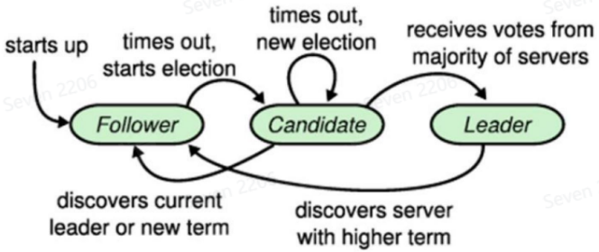
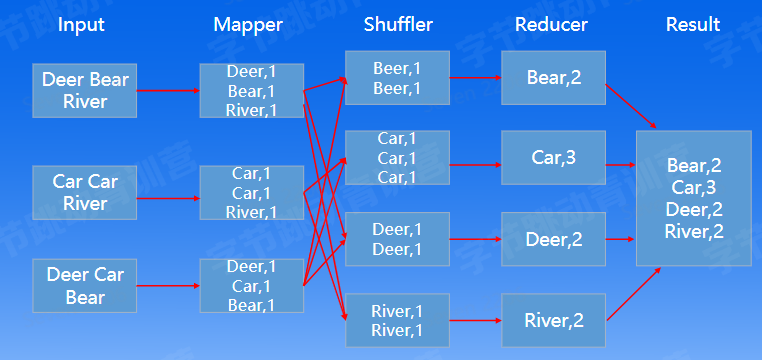

学习内容：「分布式理论 - 现代架构基石」
- 分布式概述
- 系统模型
- 理论基础
- 分布式事务
- 共识协议
- 分布式实践

# 分布式概述

## 什么是分布式？
- 分布式系统定义：计算机程序的集合，这些程序利用跨多个独立计算节点的计算资源来实现共同的目标。可以分为分布式计算、分布式存储、分布式数据库等
- 分布式系统的五大优势：去中心化、低成本、弹性、资源共享、可靠性高
- 分布式系统的挑战：故障、网络、环境、安全

## Why-How-What

**使用者视角：**

Why
- 数据爆炸，对存储和计算有大规模运用的述求
- 成本低，构建在廉价服务器之上

How
- 分布式框架
- 成熟的分布式系统

What
- 理清规模，负载，一致性要求等
- 明确稳定性要求，制定技术方案

**学习者视角:**

Why:
- 后端开发必备技能
- 帮助理解后台服务器之间协作的机理

How:
- 掌握分布式理论
- 了解一致性协议

What:
- 把要点深入展开，针对难点搜索互联网资料进行学习
- 将所学知识运用于实践

## 常见的分布式系统

分布式存储：
- Google File System (GFS)：google 分布式文件系统
- Ceph: 统一的分布式存储系统
- Hadoop HDFS: 基于 GFS 架构的开源分布式文件系统
- Zookeeper: 高可用的分布式数据管理与系统协调框架

分布式数据库：
- Google Spanner: google可扩展的、全球分布式的数据库
- TiDB: 开源分布式关系型数据库
- HBase: 开源 Nosal 数据库
- MongoDB: 文档数据库

分布式计算：
- Hadoop: 基于 MapReduce 分布式计算框架
- Spark: 在 Hadoop 基础之上，使用内存来存储数据
- YARN: 分布式资源调度

# 系统模型

## 故障模型

- 按对故障处理的难易程度来划分（最难->最易）
- Byzantine failure: 节点可以任意算改发送给其他节点的数据
- `Authentication detectable byzantine failure`(ADB): Byzantine failure的特例;节点可以算改数据但不能伪造其他节点的数据
- Performance failure: 节点未在特定时间段内收到数据，即时间太早或太晚
- Omission failure: 节点收到数据的时间无限晚，即收不到数据
- Crash failure: 在 omission failure 的基础上，增加了节点停止响应的假设，也即持续性地 omission failure
- Fail-stop failure: 在Crash failure的基础上增加了错误可检测的假设

## 拜占庭将军问题

**两将军问题**

引入: 两将军问题 ( Two Generals' Problem ) : 两支军队的将军只能派信使穿越敌方领土互相通信，以此约定进攻时间。该问题希望求解如何在两名将军派出的任何信使都可能被俘虏的情况下，就进攻时间达成共识

结论是，两将军问题是被证实无解的电脑通信问题，两支军队理论上永远无法达成共识

方案：
- 方案一: 同时发送N个信使，任何一个达到对方军队，都算成功
- 方案二 : 设置超时时间，发送后未在一定时间返回，则加派信使（通常使用，与 TCP 同）

共识与消息传递的不同 : 即使保证了消息传递成功，也不能保证达成共识

TCP 三次握手是在两个方向确认包的序列号，增加了超时重试 ，是两将军问题的一个工程解。

**三将军问题：**
- 两个“忠将”A和B，一个“叛徒”C，互相传递消息，消息可能丢失，也可能被篡改，当有一个将军是“叛徒”（即出现拜占庭故障）时，整个系统无法达成一致。
- 由于“叛徒”C的存在，将军A和将军B获得不同的信息。这样将军A获得2票进攻1票撤退的信息，将军B获得1票进攻2票撤退的信息，产生了不一致

方案：
- 引入一个将军，变成四将军

**四将军问题：**
- 考虑当4个将军，只有1个叛徒的场景
- 将军D作为消息分发中枢，约定如果没收到消息则执行撤退
- 步骤：
    - 如果D为“叛徒”，ABC无论收到任何消息，总能达成一致
    - D为“忠将”，ABC有2人将D的消息进行正确的传递，同样能保证最终决策符合大多数。
- 当有3m+1个将军，m个“叛徒”时，可以进行m轮协商，最终达成一致

## 共识和一致性
Eventually consistent(最终一致性)：客户端A读到x=0，当客户端C正在写入时客户端A和B可能读到0或者1。但是当C写入完成后，A和B最终能读到一致的数据

Linearizability(线性一致性)：当客户端A读到更新的版本x=1后，及时将消息同步给其他客户端，这样其他客户端立即能获取到 x=1
- 要保证所有客户端看到相同的值，需要多节点进行“协商”，达成共识
- 一致性和可用性是对矛盾

## 时间和事件顺序

1978年 Leslie Lamport 发表《Time, Clocks, and the Ordering of Events in a Distributed System》
- 定义了计算机系统中的时间和事件顺序，引入happened before和并发的定义，可以以此对分布式系统中的事件进行推导
- 根据上述推导，创造了Lamport逻辑时钟的概念，这个概念在分布式理论中具有革命性的意义，帮助我们在一系列分布式事件当中梳理出逻辑的先后关系。利用逻辑时钟，我们可以对整个系统中的事件进行全序排序

定义“happened before”关系，记为"一"。其满足如下三个条件
- 如果 a 和 b 是在相同节点上的两个事件，a 在 b 之前发生，则定义:a->b
- 如果事件 a 表示某个节点发送某条消息，b 是另一个节点接受这条消息则有:a->b
- 如果有 a->b 且 b->c，则有 a->c
- 当且仅当 a!->b 且 b!->a 时，我们称两个事件为并发的(concurrent)

**Lamport逻辑时钟**
- 对于每一个节点 Pi 我们定义时钟 Ci 为一个函数，它为任意的事件 a 赋值编号为 Ci(a)
- 如果 a 和 b 是在相同节点 Pi 上的两个事件，a 在 b 之前发生，则有Ci(a)< Ci(b)
- 如果事件 a 表示节点 Pi 发送某条消息，b 表示节点 P 接受这条消息，则有Ci(a)< Ci(b)

# 理论基础

## CAP 理论

- C (Consistence)：一致性，指数据在多个副本之间能够保持一致的特性(严格的一致性)
- A(Availability)：可用性，指系统提供的服务必须一直处于可用的状态，每次请求都能获取到非错的响应（但是不保证获取的数据为最新数据）
- P(Network partitioning)：分区容错性，分布式系统在遇到任何网络分区故障的时候，仍然能够对外提供满足一致性和可用性的服务，除非整个网络环境都发生了故障
- 三者无法同时达到

CAP 理论往往运用于数据库领域，同样可以适用于分布式存储方向

CAP诞生了三类系统：
- CA : 放弃分区容错性，加强一致性和可用性，其实就是传统的单机数据库的选择
- AP : 放弃一致性( 这里说的一致性是强一致性 )，追求分区容错性和可用性例如一些注重用户体验的系统
- CP: 放弃可用性，追求一致性和分区容错性，例如与钱财安全相关的系统

举例：在网络发生分区的情况下，我们必须在可用性和一致性之间做出选择。近似解决办法: 把故障节点的负载转移给备用节点负责。下图演示了如何做故障转移：

## ACID 理论
- CA系统

事务是数据库系统中非常重要的概念
- 它是数据库管理系统执行过程中的一个逻辑单元
- 它能够保证一个事务中的所有操作要么全部执行，要么全都不执行

数据库事务拥有四个特性ACID，即分别是原子性 (Atomicity )、一致性(Consistency )、隔离性 ( solation ) 和持久性(Durability)
- 原子性(A)。原子性是指事务包含的所有操作要么全部成功，要么全部失败回滚
- 一致性(C)。一致性是指事务必须使数据库从一个一致性状态变换到另一个一致性状态，也就是说一个事务执行之前和执行之后都必须处于一致性状态
- 隔离性(I)。隔离性是当多个用户并发访问数据库时，数据库为每一个用户开启的事务，不能被其他事务的操作所干扰，多个并发事务之间要相互隔离
- 持久性(D)。持久性是指一个事务一旦被提交了，那么对数据库中的数据的改变就是永久性的，即便是在数据库系统遇到故障的情况下也不会丢失提交事务的操作
- AC一定要保证，ID不一定能保证

## BASE理论
- BASE理论是针对AP系统而言的，其来源于对大型互联网分布式实践的总结
    - Basically Available（基本可用）：假设系统，出现了不可预知的故障，但还是能用
    - Soft state（软状态）：允许系统中的数据存在中间状态，并认为该状态不影响系统的整体可用性
    - Eventually consistent（最终一致性）：数据最终一定能够达到一致的状态

# 分布式事务

## 二阶段提交

定义：
- 二阶段提交（Two-phase Commit）：为了使基于分布式系统架构下的所有节点在进行事务提交时保持一致性而设计的一种演算法。

三个假设：
- 协调者和参与者进行通信
- 预写式日志被保持在可靠的存储设备上
- 所有节点不会永久性损坏，即使损坏后仍然可以恢复

正常流程：Prepare阶段和Commit阶段

异常流程：Prepare阶段失败 -> 回滚；协调者宕机 -> 重新启用新的协调者；双故障重启 -> 数据库管理员介入

两阶段提交需解决的问题：
- 性能问题：需要多次网络通信，资源需要等待并锁定
- 协调者单点故障问题：如何确定状态选出新协调者
- Commit阶段网络分区带来的数据不一致：非所有节点都收到Commit请求

两个思考：
- 日志被保存在「可靠」的存储设备上。如何保证这一点？
- 参与者Commit了，但 Ack 信息协调者没收到。怎么办？

## 三阶段提交
- 针对两阶段提交的补充，将两阶段提交中的Prepare阶段，拆成两部分：CanCommit和PreCommit机制
- CanCommit阶段：询问是否可以执行
- PreCommit阶段：重新确认是否可以执行
- DoCommit阶段：向所有人提交事务

解决了两个问题
- 单点故障问题
- 阻塞问题

另外引入超时机制，在等待超时之后，会继续进行事务的提交

思考：三阶段缓和了两阶段面临的问题，但依然没有解决
- 性能问题
- 网络分区场景带来的数据一致性问题

## MVCC

- MVCC：多版本并发控制的方法。维持一个数据的多个版本使读写操作没有冲突。所以既不会阻塞写，也不阻塞读。提高并发性能的同时也解决了脏读的问题。

悲观锁和乐观锁
- 悲观锁：操作数据时直接把数据锁住，直到操作完成后才会释放锁；上锁期间其他人不能修改数据
- 乐观锁：不会上锁，只是在执行更新时判断别人是否修改数据，只有冲突时才放弃操作

版本的选取：使用物理时钟或逻辑时钟
- 物理时钟：提供TrueTime API，有Master节点维持一个绝对时间，保证各个服务器之间时钟误差控制在ϵ内，通常ϵ<7ms。
- 逻辑时钟：中心化授时的方式--时间戳预言机（TSO），好处是无需硬件的支持

# 共识协议

## Quorum NWR模型
三要素：
- N：在分布式存储系统中，有多少份备份数据
- W：代表一次成功的更新操作要求至少有w份数据写入成功
- R： 代表一次成功的读数据操作要求至少有R份数据成功读取
- 为了保证强一致性，需要保证 W+R>N

Quorum NWR模型将CAP的选择交给用户，是一种简化版的一致性模型

引起的并发更新问题
- 如果允许数据被覆盖，则并发更新容易引起一致性问题

## RAFT协议

概述
- Raft协议是一种分布式一致性算法（共识算法），即使出现部分节点故障，网络延时等情况，也不影响各节点，进而提高系统的整体可用性。Raft是使用较为广泛的分布式协议。

三种角色
- Leader - 领导者：Leader 负责处理所有的客户端请求，并向Follower同步请求日志，当日志同步到大多数节点上后，通知Follower提交日志
- Follower - 跟随者：接受并持久化Leader同步的日志，在Leader告知日志可以提交后，提交日志
- Candidate - 备选者：Leader选举过程中的临时角色。向其他节点发送请求投票信息

四种定义：
- Log（日志）：节点之间同步的信息，以只追加写的方式进行同步，解决了数据被覆盖的问题
- Term（任期号）：单调递增，每个Term内最多只有一个Leader
- Committed：日志被复制到多数派节点，即可认为已经被提交
- Applied：日志被应用到本地状态机：执行了log中命令，修改了内存状态

状态转移：

Leader选举过程：
- 初始全部为Follower
- Current Term + 1
- 选举自己
- 向其它参与者发起RequestVote请求，retry直到
    - 收到多数派请求，成为Leader，并发送心跳
    - 收到其它Leader的请求，转为Follower，更新自己的Term
    - 收到部分，但未达到多数派，选举超时，随机timeout开始下一轮

Log Replication过程：
- 新Leader产生，Leader和Follower不同步，Leader强制覆盖Followers的不同步的日志
    - 1.Leader收到写请求w
    - 2.将w写入本地log
    - 3.向其它Follower发起AppendEntries RPC
    - 4.等待多数派回复
        - 更新本地状态机，返回给客户端
        - 下一个心跳通知Follower上一个Log已经被Committed了
        - Follower也根据命令应用本地状态机
    - 5.Follower有问题，Leader一直retry

切主：当Leader出现问题时，就需要进行重新选举
- Leader发现失去Follower的响应，失去Leader身份
- 两个Follower之间一段时间未收到心跳，重新进行选举，选出新的Leader，此时发生了切主
- Leader自杀重启，以Follower的身份加入进来

Stale读：
- 发生Leader切换，old leader收到了读请求。如果直接响应，可能会有Stale Read

## Paxos协议

Paxos算法与RAFT算法区别：
- Multi-Paxos 可以并发修改日志，而Raft写日志操作必须是连续的
- Multi-Paxos 可以随机选主，不必最新最全的节点当选Leader

优劣势
- 优势：写入并发性能高，所有节点都能写
- 劣势：没有一个节点有完整的最新的数据，恢复流程复杂，需要同步历史记录

# 分布式实践

## MapReduce

设计一个简易的 MapReduce 系统，思考如何应对故障？

- Mapper : 将输入分解为多个Job来并行处理。彼此间几乎没有依赖关系
- Shuffler : 将maper结果打乱，防止数据倾斜
- Reducer : 对map阶段的结果进行全局汇总

容错:
- Mapper故障:由中心化节点重新发起调度，新起
Mapper重跑job
- Reducer故障:重跑Mapper，代价大

## 分布式KV
设计一个简易的分布式键值系统，要求具备弹性的能力和达成线性一致

- 架构：将海量结构化数据根据Key分成不同的Region，每个Region构建一个单机KV数据库，Region之间形成Raft Groups做到强一致
- 容错: 当Node故障时，通过 Raft Learner模式进行数据修复
- 弹性: 当出现局部Key热点或数据膨胀时Region可以进行Split操作，分成两个子Region，反之收缩时进行 Merge操作

# 总结

## 思考题

1. 分布式系统有哪些优势和挑战？
2. 两将军问题为什么理论上永远达不成共识？
3. 为什么TCP采用三次握手？而不是两次和四次？
4. 为什么在4将军问题中，增加1轮协商就可以对抗拜占庭故障？
5. 什么是最终一致性？什么是线性一致性？
6. CAP理论中，请举例说明可用性和一致性的矛盾？
7. 数据库里的一致性和分布式系统中的一致性有什么区别？
8. 两阶段提交中，什么场景需要数据库管理员介入？
9. 三阶段提交缓和两阶段提交的哪两个问题？
10. 什么场景适合乐观锁？什么场景适合悲观锁？
11. 在共识协议中，为什么说允许数据被覆盖会带来数据一致性问题？
12. RAFT协议中，Leader写成功日志Log20但未同步给Followers后宕机，Follower重新选举后产生一条新日志Log20，这时Leader重启，整个系统发现两种不一样的Log20的记录，请问如何区分并拒掉前面的Log20？
13. RAFT协议中，Stale读是如何产生的？该如何解决Stale读的问题？
